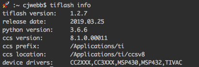

.. _started:

Getting Started
===============

.. contents::
    :local:
    :depth: 1
    :backlinks: top

Prerequisites
-------------

You will need to have `Code Composer Studio`_ installed along with drivers
for any devices you plan to use (offered during installation of CCS)

You’ll also need `Python`_ installed on your computer, either 2.7 or
3.6+ (preferred) will work.

Installing
----------

Install TIFlash with ``pip install tiflash``.

You can then do a quick test of your installation on the command line:

.. warning::
    You should see the path to your Code Composer Studio installation (if not see `Custom CCS Install Path`_)

For more examples of running tiflash please see the Examples page.

Custom Configurations
---------------------

Custom CCS Install Path
.......................

.. note::
    If you have CCS installed in the default directory, TIFlash should work out of
    box with no additional configurations.

If you installed CCS in a custom location, you'll need to provide
the path of the CCS installation to TIFlash. You can do this one of two ways:

Option #1
    Set an environment variable ``CCS_PREFIX`` to the directory of your installation(s):

    Example:

      If you have a specific version of CCS installed you want to use, set
      ``CCS_PREFIX`` to the full path of the installation: ``CCS_PREFIX=/opt/ti/ccsv8``

      If you have multiple CCS versions installed in the same directory, set ``CCS_PREFIX``
      to the parent directory ``CCS_PREFIX=/opt/ti`` (TIFlash will automatically choose the latest)

    .. hint::
        The ``CCS_PREFIX`` environment variable option is nice when you have multiple CCS installations because it allows
        you to still use the ``ccs`` session arg for choosing a version of CCS to use.

        ::

            tiflash.get_info(ccs="7")       # finds ccs version 7 in directory set by CCS_PREFIX
            tiflash.get_info(ccs="8.1")     # finds ccs version 8.1 in directory set by CCS_PREFIX
Option #2
    Pass the full path of the ccs folder as the ``ccs`` argument for every
    TIFlash command called.

    Example:

        ::

            tiflash.get_info(ccs="/opt/ti")         # TIFlash will automatically select latest
            tiflash.get_info(ccs="/opt/ti/ccsv8")   # Force TIFlash to use CCSv8

.. External Links
.. _Debug Server Scripting: http://software-dl.ti.com/ccs/esd/documents/users_guide/sdto_dss_handbook.html
.. _Code Composer Studio: http://www.ti.com/tool/CCSTUDIO
.. _Python: https://www.python.org/downloads/
